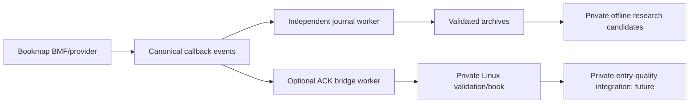

# Master engineering handoff — 2026-10-08

## Current repair after owner rejection

Owner rejected fb77a37: actual Bookmap Configuration blank and disable stalled. Runtime repair anchor `d7022e88740bc705b67c32e96327861c4bf93774` corrects reproduced host minimum-size collapse, keeps disabled-addon tabs/scrollbars navigable, avoids historical ACK capacity waits for lifecycle STOP, and closes bridge in finally. See [host/shutdown repair](docs/BOOKMAP_HOST_REPAIR_2026-10-08.md). Public tests now total 18 Java / 15 Python; six repaired-runtime integration tests passed. Corrected actual Windows Bookmap acceptance remains pending. The older "latest" UI section below is historical; final repair SHA/CI are in PR #6.

## Prior authorized UI follow-up

After the nightly checkpoint `d9da782b052b67b6d151c1198305b22f4cbf29fc`, the owner reported configuration hidden and explicitly requested tabs. Current UI now returns **one Orderflow exporter Bookmap panel** with **Configuration** selected first and **Live status** second. Configuration retains the measured network row and scrolls with Apply fixed; status diagnostics scroll with Refresh/Open export folder fixed. The two-panel statements below describe the nightly baseline, not the latest UI. No exporter defaults/network/journal logic changed. See [UI follow-up and morning check](docs/UI_TAB_FOLLOWUP_2026-10-08.md).

The nightly documentation SHA above passed Windows/Ubuntu CI [37750909614](https://github.com/Helminiak/bookmap-orderflow-exporter/actions/runs/37750909614) and [37750902487](https://github.com/Helminiak/bookmap-orderflow-exporter/actions/runs/37750902487). Resolve the newer tab build/final tip via PR #6 and git rev-parse HEAD; native Bookmap Windows visual acceptance remains pending.

## Identity and exact state

PUBLIC https://github.com/Helminiak/bookmap-orderflow-exporter. Purpose: Bookmap acquisition/normalization, deterministic raw validation and optional Linux transport; not trading inference or execution. PRIVATE https://github.com/Helminiak/orderflow-entry-engine holds research/entry-quality work. No private criteria/source or licensed raw archive is reproduced here.

Exact validated runtime/UI code anchor: `d447a6905deec882f67ab7addc8d65ff0a00fa81`. Main validated baseline: `2e0c0c79df9801a68ff9c3f3332a2ffff558ee2d` (0.4.0). Development branch `feature/linux-live-bridge` is software 0.5.0 candidate and [PR #6](https://github.com/Helminiak/bookmap-orderflow-exporter/pull/6), open draft. Benchmark/evidence checkpoint anchor: `3f0ad78f3177f86d8d352f6c8f6e4d742d41461e`. Final documentation tip and its CI are recorded in PR #6's checkpoint report and the completion report; resolve exact checkout with `git rev-parse HEAD`. A tracked file cannot embed its own future commit hash. These anchors distinguish reviewed source from later handoff metadata; never infer exact runtime from a ZIP name.

At audit, working tree was clean, HEAD matched origin, fetch introduced no divergent work, main had no newer changes, and no tags/GitHub Releases existed. Ignored `.gradle`, `build` and Python caches are reproducible development output, not unpublished source. All source at d447a69 was already pushed. Development history/branches were preserved. Unrelated governance [PR #1](https://github.com/Helminiak/bookmap-orderflow-exporter/pull/1) remains draft/unmerged; no governance merge occurred.

## Implemented, partial and proposed

Verified source implementation: API MBO/trade/time/history listeners; ID-indexed book/anomaly evidence; per-instance seq; canonical v0.1 NDJSON.GZ and summary; bounded writer buffer; buffer-full I/O/60s soft checkpoints; responsive LIVE invalidation; optional single-JAR ACKed JeroMQ bridge; same-owner bounded retention/replay, history pacing, health, same-port lifecycle reload; BAT Java/LAN discovery; original two panels with localized measured network-row height and fixed Apply. Actual settings Apply listeners and status panel were unchanged by the UI fix.

Verified tests: 13 public Java tests, 15 public Python validator tests, six private Java/Python integration tests against the freshly built public JAR, packaging/compile/whitespace checks. Local clean build uses JDK 17/Gradle 8.10; source anchor has green Windows/Ubuntu CI [37748294289](https://github.com/Helminiak/bookmap-orderflow-exporter/actions/runs/37748294289). Final closeout CI is linked from the checkpoint report, not retroactively asserted by this older run.

Partially accepted: actual owner-operated Bookmap loading and Linux HEALTHY; reviewed 60s/118-sample report has 4,656 new published/ACKed events, no query/bridge/journal errors, stable session/receiver and caught-up seq 1,553,902. Separate 57,771-event PASS is owner-reported. Exact installed JAR is not encoded in the supplied report. UI bounds pass font-scale 100/125/150% tests and inspected Linux Swing previews; actual Bookmap Windows DPI inspection remains open. Broad sustained load, bridge-off/on slowdown, callback concurrency, retained heap, crash/disk-full/exceptional stop coverage are not certified.

PRIVATE candidates: PR #4 receiver source; PR #2 Arrow compilation/accelerated MBO replay; PR #3 causal dataset layer. They remain separate/unmerged and were not fully research-recertified in this public closeout. Only generic authorized receiver integration was run. No public Tier-2 compiler, Tier-3 feature formulas, snapshot/resume, authenticated transport, durable spool, production execution or model is implemented. Those are proposals/other-repository candidates.

## Architecture and decisions



Read [ARCHITECTURE](docs/ARCHITECTURE.md), [ENGINEERING_DECISIONS](docs/ENGINEERING_DECISIONS.md), [DATA_PIPELINE](docs/DATA_PIPELINE.md), [EVENT_SCHEMA](docs/EVENT_SCHEMA.md), [LINUX_BRIDGE](docs/LINUX_BRIDGE.md), [PERSISTENCE_AND_RECOVERY](docs/PERSISTENCE_AND_RECOVERY.md). Reasons: preserve one acquisition stream, canonical readable authority, MBO-only state mutation, strict HISTORY correctness, responsive LIVE explicit failure, independent output workers, bounded ACK retention and clean public/private split. Earlier tab/enlargement UI experiments are historical and superseded. Capacity choices have no recovered quantitative optimum rationale.

## Build, deploy and tools

Clone/fetch; do not overwrite local work. Install JDK 17, Gradle 8.10, Python 3.12; API 7.6.0.20 from Maven. No Gradle wrapper is present. JeroMQ 0.6.0/jnacl are bundled, Bookmap APIs compile-only. Java 17+ runtime; Java 25 was found on the owner's Bookmap installation, not fully recertified as a CI matrix.

```sh
git fetch --all --tags
git status --short --branch
git rev-parse HEAD
gradle --no-daemon clean test jar writeFixtureClasspath smokeTestBundle
python -m unittest discover -s tests -v
python tools/benchmark_exporter.py --classpath-file build/fixture-classpath.txt --output benchmark-result.json
```

Install `build/libs/bookmap-orderflow-exporter-v0.5.jar`, one addon only. ZIP at `build/distributions/orderflow-v0.5-windows-smoke-test.zip` includes BAT/PS1/README. Close Bookmap to replace; start private receiver before opening/enabling/applying a fresh bridge. Restart a receiver with accepted events before starting another publisher session. Do not Apply again to a healthy session unnecessarily. BAT discovers Java/LAN, reads health only and saves diagnostic report; idle output INCONCLUSIVE is not a PASS. Configuration save/reload uses Bookmap API and begins a new archive.

Actual defaults: export MBO/trades true, writer queue 1m (10k–5m), compressed-output buffer 4 MiB, checkpoint 60s (5–300s), bridge off, bind 0.0.0.0, data/health 5555/5556, bridge retention 100k, responsive LIVE journal true. Blank output uses environment then user home; blank tag may use environment. Legacy flushThresholdMiB remains saved-compatible but is not a v0.4+ flush trigger. Disabled exports invalidate a bridge claiming full MBO/trade completeness. See README table and TESTING_AND_TROUBLESHOOTING.

## Reliability, performance and security

Fresh journal-only synthetic actual-callback benchmark: 190,003 records, CRC/schema/summary match, 60k final orders, 2,783,282 compressed bytes, zero drops/overflows; 3.001s process wall including overhead, ~63.3k records/s, Java peak RSS ~475.8 MiB. RSS is not retained queue size; the 400–1,000 bytes/event sensitivity range in PERFORMANCE is explicitly estimated. Prior bridge trials at 5k/50k/100k complete; 250k invalidates at capacity. No Bookmap slowdown is inferred. Mixed physical callback max 1.545s may include historical waiting and cannot establish LIVE latency.

HISTORY writer can wait until capacity/error/interrupt, HISTORY bridge waits/drain up to ten seconds, LIVE non-waiting path still allocates/does map work/atomic CAS and can suffer GC/scheduling. Strict LIVE setting permits waiting. `records_persisted` advances into writer buffers, application I/O is OS handoff, and ACKs are receiver in-memory validation; none means fsync/durable storage. Clean EOF/STOP/summary validates logical export, not power-loss durability.

Unauthenticated bind-all interface is trusted-LAN-only; use firewall/interface restrictions and unique ports per instrument. No credentials are used for owner tokens. Preserve licensed archives locally, hashes/provenance and anomaly evidence. Crash/replay rewind/missing initial population must not be certified as complete. Outstanding reviewed shutdown cleanup and diagnostic/parser/threading issues are release risks, not silently fixed in this documentation session.

## Risk register and next tasks

[KNOWN_ISSUES_AND_RISKS](docs/KNOWN_ISSUES_AND_RISKS.md) has IDs, severity, evidence, subsystem, remediation and verification. Created issues [#7](https://github.com/Helminiak/bookmap-orderflow-exporter/issues/7) native DPI/load acceptance, [#8](https://github.com/Helminiak/bookmap-orderflow-exporter/issues/8) exceptional shutdown cleanup, [#9](https://github.com/Helminiak/bookmap-orderflow-exporter/issues/9) ownership/protocol/counters, [#10](https://github.com/Helminiak/bookmap-orderflow-exporter/issues/10) heap/overload/storage, [#11](https://github.com/Helminiak/bookmap-orderflow-exporter/issues/11) security/per-alias ports, [#12](https://github.com/Helminiak/bookmap-orderflow-exporter/issues/12) provenance/initial book/recovery. Windows CI has no current failure; old artifact-path/negative-exit/reconnect failures and reproduction are recorded in TESTING_AND_TROUBLESHOOTING.

Prioritize: (1) native DPI and matched heavy load to finish user-facing/runtime acceptance; (2) exceptional cleanup to prevent leaked sockets after failure; (3) callback ownership/protocol diagnostics to protect integrity claims; (4) memory/storage/network budgets and isolation to bound failure exposure; (5) repeated-BMF/initial-book lineage before approving private research. ROADMAP gives milestone gates. No feature development beyond scoped closeout is authorized by this task; new work needs a scoped issue/user request.

## Resume instructions and knowledge limits

Future Codex/ChatGPT/Claude engineers: read AGENTS plus this handoff and linked architecture/decisions/risks first; fetch safely, inspect actual SHA/tree/PR overlap and current CI, then select a documented issue. Preserve chronological seq and private boundary, run relevant tests, distinguish proposed/observed/verified, update evidence, and do not force-push or merge unverified changes. Do not treat CI, a filename or a HEALTHY badge as a release certificate.

Important paths: src/main/java/com/limacharlie/orderflow (runtime/layout), src/test (fixtures/regressions), tools/validate_export.py, tools/benchmark_exporter.py, tools/windows, .github/workflows, docs/validation (aggregate evidence), SCHEMA.md, CHANGELOG.md and docs/VERSION_HISTORY.md. Original milestone/history records are retained; handoff/CURRENT_STATE.md points here.

Unavailable/not established: original supplied smoke report no longer readable at its SMB path during closeout (earlier inspection aggregates retained, no invented source hash), complete licensed BMF inventory, summary-only paired archive, provider-wide completeness, exact deployed smoke-test JAR hash, actual Bookmap windows screenshots at all DPI, sustained performance target, full callback threading guarantee, retained-heap profile, fsync/crash durability, every private candidate's full acceptance, and unpublished early rationale not recovered from Git. These remain explicit uncertainties, not verified facts. See SESSION_CLOSEOUT_2026-10-08 for performed work and final publication procedure.
