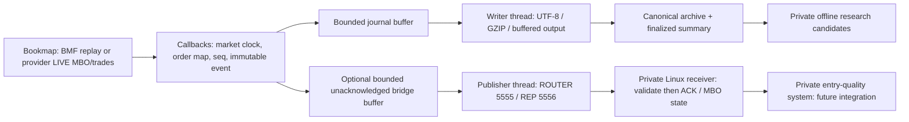

# Architecture — implemented exporter versus downstream systems

`BookmapOrderflowExporter` implements Simplified API MBO depth, TradeData, Time and HistoricalMode listeners. InstrumentInfo supplies alias, pips and multiplier. Bookmap/provider timestamps enter via TimeListener as nanoseconds represented by long; nanosecond units do not prove exchange-clock accuracy. Equal timestamps are allowed; seq provides within-instance ordering. Source callbacks are assumed serialized; HashMap, seq and some counters depend on that assumption and require API/thread verification (issue #9). The supplied InitialState argument is not explicitly serialized as a snapshot.

BMF is proprietary Tier 0 decoded by Bookmap; no parser is implemented here. Historical/replay phase follows onRealtimeStart, not a promise that wall-clock playback is exchange real-time. The exporter records what the API delivers: provider subscriptions, initial-book population, attachment timing and export filters limit completeness. It cannot certify all exchange events. A rewind yields TIME_REVERSAL evidence and strict dataset validation rejects it.

MBO add stores side/level/size by ID; replace/cancel use that state and retain anomaly evidence for missing IDs. Trade callbacks preserve aggressor/passive IDs and execution flags, but do not mutate the MBO map. Event fields are copied before background encoding. Each output has its own bounded queue; the same CanonicalEvent may be shared by both. Workers own encoding/compression/network operations; Bookmap owns callbacks and its settings API; Swing refresh is throttled and dispatched on EDT.

Implemented private receiver candidate: generic schema/seq/lifecycle/pips validation, deterministic MBO reconstruction, cumulative ACK, health, same-process reconnect and LAN startup. It is in PRIVATE PR #4, not merged public code. Private Arrow/offline replay and causal model-dataset candidates exist in PRIVATE PRs #2/#3; their full acceptance is outside this closeout. No public model, inference, execution or trade-management system is implemented.

See [persistence](PERSISTENCE_AND_RECOVERY.md), [bridge](LINUX_BRIDGE.md), [schema](EVENT_SCHEMA.md), [thread/performance limits](PERFORMANCE.md) and [boundary](PUBLIC_PRIVATE_BOUNDARIES.md).
