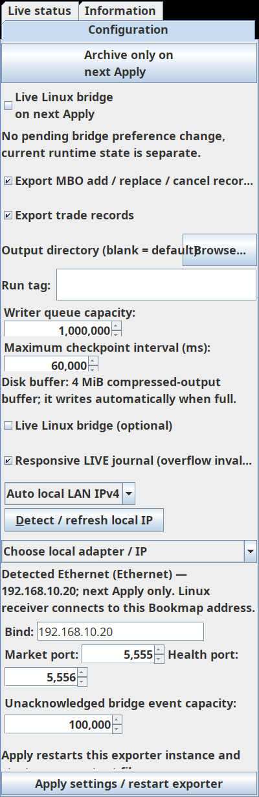

# Issue16 explicit local LAN IPv4 selection — REVIEW PENDING CHATGPT

Source `5c0e37f2c52c87efd3fad3a80bd53b12d91c8067`, base `ff33cd0b3b2d451404c52406e3742cc2bbecc0cf`. Distinct stacked [draft PR20](https://github.com/Helminiak/bookmap-orderflow-exporter/pull/20), branch `agent-a/lan-ipv4-selection-20261009`, based on current PR19 to preserve the approved recovery integration and diagnostic tests. [Exact six-file code diff](https://github.com/Helminiak/bookmap-orderflow-exporter/compare/ff33cd0b3b2d451404c52406e3742cc2bbecc0cf...5c0e37f2c52c87efd3fad3a80bd53b12d91c8067). Earlier issue16 branch suggestion predated actual recovery integration; current stack preserves it without changing its installed/staged artifact. PR19/source59ca1e8 diagnostic review is independent and not approval for this new code.

## User-visible behavior / actual integration

Real `buildExporterTabs` constructs `LanBindControls` adjacent to Bind/ports. Explicit **Auto local LAN IPv4** reads local JDK NetworkInterface/Inet4Address metadata in SwingWorker, prefills the draft for one suitable address and reports adapter/IP. Multiple plausible addresses leave Bind unchanged and require a selector choice. Manual typing switches mode to Manual; stale automatic results cannot overwrite manual text. Detect/refresh in Manual updates metadata only, preserving the field. No detection can save Settings, Apply/restart exporter or change the currently bound session.

`bridgeBindMode` is an additive saved setting, default/manual when absent, null or unrecognized. **Conservative migration is explicit opt-in Auto for BOTH fresh and legacy settings.** Factory0.0.0.0 cannot safely be distinguished from a deliberately saved wildcard with the existing API contract; this patch does not silently infer first-time state or auto-switch an existing saved configuration. It therefore does not claim automatic first-run prefill without selecting Auto. Request review of this tradeoff against issue16's first-time preference; native serializer/migration acceptance remains PENDING.

Original Apply listener validates enabled bridge Bind **before any Settings mutation**, then saves the draft Bind/mode through the existing single setSettings/reload path. Wildcard0.0.0.0 remains explicit Manual and always supported. Other manual addresses require a refreshed UP/local IPv4 snapshot (including intentionally selected local public/loopback/VPN addresses); nonlocal/receiver IP/hostname/IPv6/malformed values are rejected without DNS. New manually typed address before a snapshot receives clear Detect/refresh instructions. Archive-only skips Bind validation so recovery cannot be blocked by a stale invalid bridge address.

Auto candidates require UP, nonloopback, nonvirtual RFC1918 IPv4 and exclude known VPN/VM product/interface names. Multiple equally valid addresses are not arbitrated by adapter order. Sorting/dedup is deterministic, not evidence of route quality. No default-route/gateway lookup, UDP/TCP probe, DNS, shell, firewall/security access, paid cloud inference or discovery packets. No protocol/queue/journal/schema/default port/bridge-enabled behavior changed. Runtime startup still uses saved literal Bind; automatic UI detection stages the next explicit Apply only.

## Layout, validation and failures preserved

New discovery subsection uses existing responsive row layout, wrapped/selectable readonly status and accessibility names/mnemonic. Future available width feeds wrap measurement. Existing settings rows retain their baseline: the new multirow subsection is excluded from equal-height baseline and retains its measured minimum height with zero vertical compression weight. This fixes observed clipped terminal text at400px/150% font scale (glyph ending78px in76px text area), and avoids enlarging every existing row. No fixed-height dialog increase, new nested configuration viewport or Live status layout change.

- Initial10 new helper/UI tests passed9 and failed the actual painted/terminal-glyph layout check. Width/minimum adjustments alone did not fix it; natural discovery-row weighting did. Failure logs retained privately; no assertion weakening or CI rerun to hide them.
- Final12 new tests plus prior58: **70 Java tests, zero failures/errors/skips**, JDK17/Gradle8.10 clean test/jar/classpath/bundle exit0.
- Python3.12 canonical validators: **15 PASS**, exit0.
- Helper cases: one NIC; Ethernet+Wi-Fi/multiple-IP ambiguity; virtual/VPN/down/loopback/link-local/public/IPv6 exclusions; RFC1918 boundaries; stable duplicate handling; manual/wildcard preservation; active local public/VPN/loopback explicit Manual; nonlocal/renumbered/malformed rejection; legitimate “Virtual LAN - Production” display name not incorrectly excluded.
- Actual production-tab/API tests: no save/reload before Auto; exact once on Apply; saved Bind/mode; invalid nonlocal Bind rejected **before another staged MBO field mutates Settings**; delayed-result manual override; metadata error visible; manual before Auto requires explicit refresh and remains unchanged; ambiguous choice/typed Manual override; actual painted bounds/terminal glyph across400/560/800/400 widths and100/125/150% fonts. Existing actual StrategyPanel/outer-host/ports/Apply tests retained.
- [Exact-source Windows/Ubuntu CI37894061265](https://github.com/Helminiak/bookmap-orderflow-exporter/actions/runs/37894061265): **PASS on Windows and Ubuntu**, no rerun.
- Candidate source-bound JAR:640805bytes, SHA256 `4c665208f8add15a6b25777972f16d60531cf882090d253a7abedf215fff2f3d`. Manifest source5c0e37f/dirty=false verified; all33 runtime class entries hash-match the classes from passing tests after recompiling jar; JeroMQ included, Bookmap compile-only classes absent. Local-only distinct `bookmap-orderflow-exporter-LAN-IPV4-CANDIDATE-5c0e37f.jar`; **not staged/installed**. No review artifact replaces approved Windows preview83af7d48.

## Local Qwen and independent assessment

First bounded implementation request under shared lock failed HTTP500 and produced no accepted source; local services/model/credentials were preserved. Codex implemented the candidate. Independent bounded helper/worker/validation Qwen review completed3822 input/6372 output tokens (4446 reasoning), useful visible output. Qwen saw supplied fragments and test descriptions, not a full repository/test audit. It flagged manual snapshot dependency, overly broad generic “virtual” filter and hypothetical typed-Auto policy. Codex retained required strict local validation, clarified manual refresh instructions, replaced generic substring with specific product filters and added regression. Its typed-Auto concern was disproved by actual constructor DocumentListener; new test explicitly verifies typed valid candidate becomes Manual and validates. A narrower actual-listener/Apply follow-up completed2519 input/6613 output tokens (5444 reasoning). Its conditional adapter-selection concern omitted the existing `setDraft` listener guard. Codex verified that guard and added an explicit assertion that selecting an adapter preserves Auto mode; all70 tests pass. No production fix was applied for this disproved hypothesis. No unverified model advice or “merge” wording is authorization.

## Risks / outstanding limitations

Native Bookmap, physical Windows100/125/150%DPI, dark theme, actual Bookmap settings deserialization and owner-operated Apply remain **PENDING / NOT RUN**. Rendered evidence below is Linux Swing with synthetic interface data. At400px/150% the pre-existing output-directory row and some long checkbox labels are constrained/truncated; this patch does not redesign those unrelated rows or claim whole-panel visual acceptance. New discovery fields/status/Bind/ports/Apply passed their geometry gates.

Metadata can become stale after discovery; refresh after adapter changes. Name-based VPN/VM filtering is heuristic and can miss unknown virtual products or exclude branded uplinks; explicit Manual remains local-validated. No route/reachability guarantee. Manual local nonwildcard needs metadata available before Apply; network-interface API failure permits Manual wildcard fallback, not nonlocal acceptance. Readonly instructions identify this **Bookmap publisher** IP, never the Ubuntu receiver IP. Intermittent WELCOME/ACK and historical overflow remain OPEN; diagnostic PR19/source59ca1e8 is separate. New candidate has no production/native approval, merge/release/Marketplace gate bypass.

## Requested independent decision / next action

Request exact-source `CHATGPT_REVIEW_V1` for production UI wiring, conservative migration, local validation/async generation behavior, responsive layout and tests. Correct ordinary findings without owner interruption; do not treat older approval83af7d48 as covering5c0e37f. After development review, continue isolated refinement and prepare owner-controlled native checklist; **no new Windows JAR staging/install/load/restart/activation/Apply without scope authorization**. Existing approved/staged recovery preview and owner native checklist remain [here](AGENT_A_RECOVERY_INTEGRATION_83af7d4_REVIEW.md).

Rendered and inspected Linux Swing at5557642 with synthetic NIC metadata; runtime classes are unchanged at5c0e37f (additional test assertion only). Not native Bookmap acceptance.
