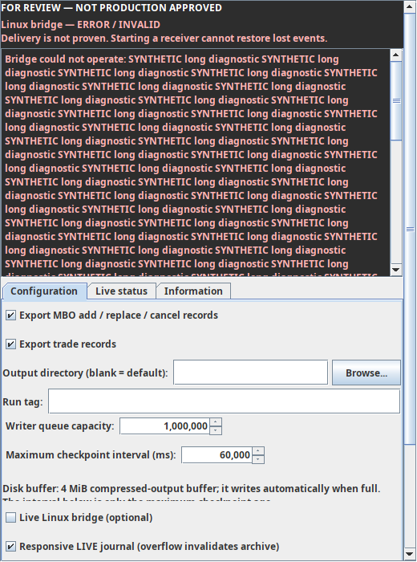
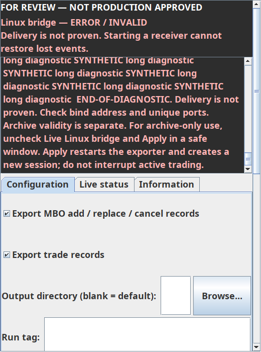
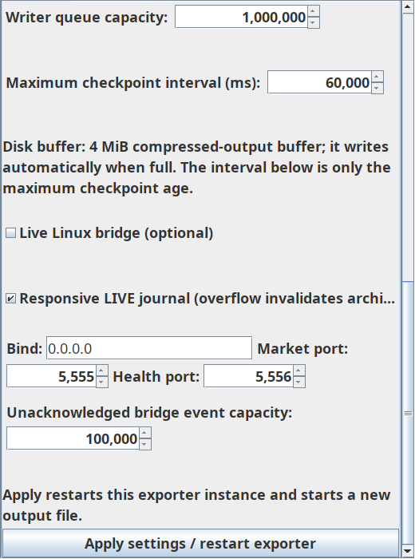

# Agent A — v0.5a notice correction ready for owner review

Evidence finalized 2026-10-09 UTC (2026-10-08 owner local date). **STOPPED for owner inspection; Agent B remains paused.** No merge, release, deployment, live activation, or changes to approved v0.4.

## Source and review artifact

Exact tested source: `5f840f3a20c43865da5889ded97b90cce1a883b4`, branch `feature/agent-a-receiver-warning`, [draft PR15](https://github.com/Helminiak/bookmap-orderflow-exporter/pull/15). Later documentation commits do not replace this artifact source.

Complete local clean-build JAR: `bookmap-orderflow-exporter-v0.5a.jar`, 619586 bytes.
SHA-256: `1f62776a44ffc5a6e368d3344932510b6416bd06bacf719477b58b15083a078e`.
Complete local smoke bundle: `orderflow-v0.5a-windows-smoke-test.zip`.
SHA-256: `21f100824baab6d7aed259b8ad44db4afb048f136e9282258e8b67a564d06cd0`.

Published [Ubuntu JAR artifact](https://github.com/Helminiak/bookmap-orderflow-exporter/actions/runs/37871090572/artifacts/11591000436) has SHA-256 `ce52dbcb0df82e0745a66170e82795f7d582cc253626c901109cbecc9ed7d16f`. Every uncompressed entry, including all classes and manifest, is byte-identical to the local JAR. ZIP-container bytes differ across environments; do not compare this download against the local-container checksum. Both CI environments independently pass same-environment repeat-build checksum checks. [Windows JAR artifact](https://github.com/Helminiak/bookmap-orderflow-exporter/actions/runs/37871090572/artifacts/11591050336) has SHA-256 `0ec1445eb4c5718ea0fdf378cd0b7ff1275a1cc42b710b9deba59abd4b9afb53`. Classes and manifest match the local JAR exactly; three notice/license text resources use Windows CRLF instead of LF. Use the checksum for your chosen artifact. Cross-platform whole-archive reproducibility is not claimed.

[Package verification metadata](NOTICE_5f840f3_PACKAGE.json) records exact source, version, dependencies, class correspondence and both checksums. `Implementation-Version: 0.5.0` is the existing semantic version; `Orderflow-Build-Revision: 0.5a` identifies this review build. This convention is intentional, not a loader-compatibility claim.

## Root cause and correction

There was no explicit four-line limit. The original wrapped text preferred height depended on parent/grandparent width before final allocation, and mutated the painted text view during sizing. BorderLayout NORTH then requested that height without a constrained-height fallback or scrollbar. A controlled original-source 400×160 Swing host reproduced an invisible final glyph (y1360) and negative tab height, with no detail scrollbar. This proves the layout defect; it does not establish the exact geometry of the owner's Bookmap four-line symptom.

The corrected notice separates a pinned, wrapping, selectable review/status/consequence heading from scrollable full details. A private text measurer shares the document without mutating the painted view; final-glyph geometry supplements preferred size, including fractional Windows font metrics. HostLayout prepares the actual upcoming width and budgets against the visible ancestor viewport, reserving existing tabs. Full details expand when space permits; otherwise vertical scrolling reaches the terminal character. Complete-page minimum sizing preserves outer scrolling to Apply. No absolute component positioning or superficial fixed-height increase is used.

State changes update text, accessibility and layout on the EDT, reset detail scroll to the beginning and repaint. Unchanged polling does not rewrite documents. Existing timer lifecycle is preserved. No new I/O or processing was added to market-data callbacks. Heading and detail foreground colors are tested against their actual painted background with a 4.5:1 contrast floor; status words remain explicit. Configuration tabs, instructions, controls, defaults, bridge/journal/queue behavior and Live status layout remain unchanged.

## Files changed for this correction

- `BridgeOperatorNotice.java`: adaptive measurement, pinned summary, selectable complete scrolling details, host sizing and contrast.
- `BookmapOrderflowExporter.java`: one root-layout substitution to HostLayout.
- `BridgeNoticeViewportTest.java`: actual constrained layout, rendered glyph/scroll reachability, font/state/resize/accessibility/contrast/outer controls and synthetic preview entry point.
- `BridgeOperatorNoticeTest.java`, `ExporterTabsTest.java`: adapt existing tests to the split heading and settled host layout, preserving assertions.
- `BridgeHealthQueryTest.java`: observe asynchronous readiness with the existing bounded helper before the original single one-second query; always close first fixture on assertion failure. Test-only; no delivery assertion suppression or production change.
- `build.gradle`, `.github/workflows/plugin-build-test.yml`: render and upload synthetic screenshots plus JUnit evidence.
- Handoff, risks, this review/index/package metadata and synthetic screenshots.

## Validation and failure history

Clean JDK17/Gradle8.10 build: **PASS**. 36 Java tests, 15 Python validator tests: **PASS**, zero failures. Repeated local JAR and ZIP build: identical checksums. All24 tested main class files match packaged entries. JeroMQ/jnacl and notices are present, Bookmap compile-only API classes excluded. Smoke bundle contains the identical JAR. Final production class bytes are identical to independently Qwen-reviewed UI source `5aa1ddc`; `5f840f3` adds test readiness/handoff only.

Exact-source [push CI](https://github.com/Helminiak/bookmap-orderflow-exporter/actions/runs/37871090572) and [PR CI](https://github.com/Helminiak/bookmap-orderflow-exporter/actions/runs/37871094581): Windows and Ubuntu **PASS**, including package checks, Windows smoke launcher and rendered regression evidence.

New viewport tests cover short/long messages, WAITING FOR RECEIVER, CONNECTED, DISCONNECTED, ERROR/INVALID; widths280/400/760, font scales1/1.25/1.5 and fractional font transitions; window resizing, state transitions, selectable exact text/accessibility character count; actual terminal-glyph bounds, scrollbar endpoint, tab visibility, network row bounds and outer Apply reachability. They inspect assigned/painted layout, not only preferred-height calculations.

Initial `ba7772d` Windows CI exposed narrow-width fractional-font summary clipping despite local success. That artifact is superseded. The separate measuring view and fractional-font transition test fix it. `5aa1ddc` PR Ubuntu CI failed its first health query before close/rebind: it did not observe asynchronous startup. The test now waits for existing readiness, retaining original query assertions. Final exact-source matrices pass. The remote startup delay's underlying cause is unproved; the older intermittent WELCOME issue remains distinct and open.

Local Qwen used the expert-prompt-library router for baseline analysis, candidate code/test/performance review, final UI/package review and final source-bound metadata review. All completed authenticated requests. Its summary-clipping concern was independently confirmed by Windows CI and corrected. Speculative off-EDT readers/LAF mutations were not treated as confirmed defects. Final metadata review found no confirmed functional packaging defect; version convention is documented above. Inherited duplicate-entry policy is unchanged; future dependency growth needs separate review. Qwen did not certify JAR bytes; direct tool verification did.

## Visual evidence and limitations

A realized local Linux Swing frame was rendered at this source; the images below were actually inspected. These are **synthetic Swing-host evidence, not native Bookmap acceptance or physical Windows DPI testing**. Headless CI also renders evidence.

**Native Bookmap corrected-JAR acceptance: PENDING. Actual Windows100/125/150%DPI: PENDING.** Existing Windows helper now responds and captures the current add-on dialog, but no corrected JAR was installed/activated and that screenshot proves no corrected-source acceptance. Existing unrelated long checkbox labels may ellipsize at narrow enlarged-font widths; unchanged and outside this notice correction. Extremely small host windows require the existing outer page scrollbar. Live load/soak/closed-panel global warning/storage durability and prior risk-register items are not certified by this UI package.

## Safe owner testing and next action

1. Inspect this report and source-bound artifact. Verify the checksum corresponding to the selected local or CI build and manifest source5f840f3. Do not use superseded ba7772d or older same-named JARs.
2. Only after separate owner installation/activation authorization, use a safe maintenance window, close Bookmap cleanly, preserve the installed JAR and settings, and use a single corrected addon JAR. No running-session overwrite.
3. Open Configuration, Live status and Information. Check waiting/connected/disconnected/error messages, full detail scrolling and text selection, resizing/narrow widths, dark theme, actual100/125/150%DPI, network fields and outer Apply reachability. Do not restart exporter or change active-feed settings merely to generate states without a safe window.
4. Record installed SHA, screenshots, state transitions and observed responsiveness. If rejected, restore the preserved addon while Bookmap is closed. Native acceptance and merge/release remain separate gates.

**Next action: owner inspect the JAR/evidence and authorize or reject safe native testing. Agent A stops here; Agent B remains paused.**
