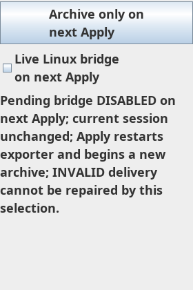

# Issue17 synthetic recovery controls — REVIEW PENDING CHATGPT

Base `b70a278027eb75ab5a0276bdd1f87ad0949b464a`; exact code source `303b6ca0df0ca4a99344948da7d09d31f363689e`. PUBLIC exporter assigned branch `agent-a/native-bridge-recovery-20261009`, [draft PR19](https://github.com/Helminiak/bookmap-orderflow-exporter/pull/19). [Exact code diff](https://github.com/Helminiak/bookmap-orderflow-exporter/compare/b70a278027eb75ab5a0276bdd1f87ad0949b464a...303b6ca0df0ca4a99344948da7d09d31f363689e). Prior approval source33fcd9d covers only the helper/next synthetic prototype; **no approval for this new code is claimed**. Later documentation SHA is distinct from tested artifact source.

## Changes and requested decision

Added `BridgeRecoveryControls.java`, `BridgeRecoveryControlsTest.java`, `BridgeRecoveryApplyPrototypeTest.java`. Controls use one saved-preference baseline/draft, named checkbox and mnemonic archive-only button, selectable wrapped pending text and GridBagLayout. Independent measuring text view avoids changing the displayed view and checks terminal glyph height. Labels wrap naturally over two lines; no fixed-position component placement or altered font sizes.

Request ChatGPT review of component/draft semantics, actual test assertions and the proposed next Bookmap host integration. **This standalone prototype is not wired into production Bookmap panels. Issue17 is not closed.** In the synthetic host, placing controls outside scrolling content keeps them visible when that content scrolls. Actual Bookmap outer viewport may scroll the entire root; this must be addressed in the next host adaptation before claiming always-visible native recovery.

## Tests and observed behavior

- 7 baseline draft tests retained;11 controls tests cover reversible selection, archive-only action, fresh baseline, independent panels, mnemonic/accessibility, pending wording, actual constrained geometry and rendered terminal glyph at widths280/520, heights420/600, font scales1/1.25/1.5, resize/state transitions, complete text selection and keyboard ActionMap invocation. Geometry verifies button label extents as well as control rectangles. This is not physical keyboard/DPI acceptance.
- 1 synthetic adapter test shares the recovery checkbox model with the existing exporter checkbox and executes the actual existing Apply listener using a fake Api. Draft actions leave saved settings, journal flags, bind value and save/reload counts unchanged. Reversal is tested. Explicit Apply saves once/reloads once; newly constructed controls use newly saved preference with no stale pending baseline. No installed Bookmap APIs were called.
- Exact-source JDK17/Gradle8.10 `clean test jar writeFixtureClasspath smokeTestBundle`: exit0,55 Java tests, zero failures/errors/skips.
- Python3.12 `-m unittest discover -s tests -v`: exit0,15 passed.
- Focused isolated public Qwen worktree tests: final exit0,19 recovery tests passed. Earlier compiler/layout failures are retained privately, not suppressed.
- [Exact-source Windows/Ubuntu CI37886818219](https://github.com/Helminiak/bookmap-orderflow-exporter/actions/runs/37886818219): PASS on both Windows and Ubuntu, completed without a rerun.
- Clean uninstalled JAR SHA256 `125119cacfd36f7710f1a6c54918c73afa4907f31401cd07f87d8c429e465f0e`; manifest source303b6ca/clean flag verified, all27 tested main class entries byte-identical to package, JeroMQ present and Bookmap compile-only API excluded. Local candidate was retained outside Git, never placed in Windows Downloads or installed. CI independently checks reproducible packaging; cross-platform container hashes not assumed identical.

## Local Qwen and independently corrected findings

One authenticated local Qwen implement request ran in a separate PUBLIC worktree under the shared nonblocking `single-qwen.lock`; completed2897 input/13198 output tokens (10737 reasoning). Complete valid allowlisted JSON supplied two source files; Qwen did not run tests. Codex added the real Apply-listener adapter test and further selection/resize/host checks. No lock bypass or overlapping A job; no further Qwen job launched after B reported acquiring the released lock.

Generated tests lacked Java imports; an initial compile failed. Independent inspection also found `deriveFont(scale)` used scale as an absolute one-point size rather than a multiplier, and the terminal-glyph assertion checked wrong x coordinates but no y visibility. Corrected to real recursive font scaling and whole local visible rectangle checks before acceptance. Those checks reproduced actual clipping: terminal glyphy85..102 versus allocated text height17. GridBag weights/fill, an independent wrap-height measurer, terminal-glyph height and multiline labels fixed it. No weaker assertions or blind reruns used.

## Inspected visual evidence

This rendered Linux headless Swing prototype was inspected; full pending/INVALID explanation and controls are visible. **Native Bookmap and Windows100/125/150%DPI PENDING.** This screenshot does not depict actual Bookmap integration or a Windows display. Actual dark-LAF integration/contrast, extreme tiny viewports, high-load responsiveness and confirmed global mnemonic routing remain to be tested; default component colors follow current Look-and-Feel. No measured market throughput/performance improvement is claimed. Current production controls and callback paths remain untouched.

## Scope, risks and rollback

No feed/capture, broker/trading, queue, transport, schema/default, active archive or INVALID mutation. Model/widget are EDT-confined and unreferenced by production code. Native release quality is not certified by uninstalled prototypes. Issue16 LAN detection remains a separate upcoming task. The intermittent terminal-WELCOME CI failure/historical overflow remain OPEN; one passing build cannot close them.

Rollback is reverting these three additions on the assigned development branch; no persisted settings or active session needs recovery. Public staged diff checked for secrets/licensed/private data; only synthetic screenshot/source/evidence published. No merge/release, Windows JAR replacement, restart, capture/trading/security or owner-reserved action.

## Coordination and next safe work

Private A scope order revision2 adopted. Running existing supervisor has scope interval600s and no inference. A WORKING during development; it checks scope independently but does not poll GitHub review comments in that state. After actual packet submission, A enters WAITING_FOR_CHATGPT for exact PR19/source303b6ca, first review check after5min then10/15/30/45/60min, hourly thereafter; watcher reports do not authenticate approval. No manual review polling loop or inferred signoff. Next development: review/fix this component and build isolated Bookmap-compatible root/viewport adapter tests, preserving original tabs/manual Apply; proceed with issue16 separately when suitable local Qwen time is available. Owner-only native install/restart/merge/release gates remain.
