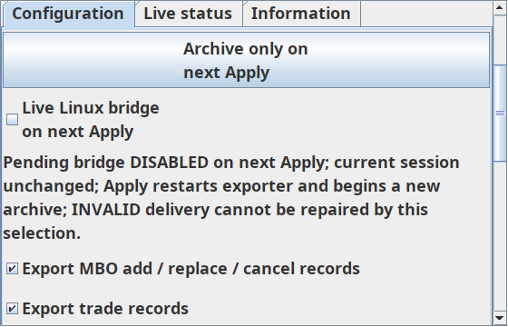

# Issue17 real Bookmap recovery integration — APPROVED; UNINSTALLED preview staged

Exact source `83af7d48d6c53f4c0a50f7eb440e13653878e7e0`; base `65b3a4885ca2a8919e3446b7b6046e22f954fbf8`. [PR19](https://github.com/Helminiak/bookmap-orderflow-exporter/pull/19). [Bounded integration diff](https://github.com/Helminiak/bookmap-orderflow-exporter/compare/65b3a4885ca2a8919e3446b7b6046e22f954fbf8...83af7d48d6c53f4c0a50f7eb440e13653878e7e0). Prior303b6ca approval covers the standalone controls only; it is not approval for this integration. Later evidence commits differ from tested artifact source.

## Actual production correction

Previously the recovery widget was unreferenced by the production exporter; a test-only adapter connected it to Apply. `BookmapOrderflowExporter.buildExporterTabs` now creates it at the top of Configuration, immediately below the tabs. The existing form checkbox and new recovery checkbox share one ButtonModel. Archive-only selection stages false; either checkbox can reverse that draft. Existing Apply alone saves Settings and calls reload. The unchanged Apply note explains the restart/new output file. No transport, callback, queue, journal, schema, default or integrity behavior changed.

`BridgeRecoveryControls.java` marks readonly pending text as navigation so it remains readable/selectable when the add-on is disabled. Editing and Apply remain disabled when Bookmap supplies no Api. `buildPanels` is package-visible for tests of the actual production StrategyPanel, not a replacement layout. Configuration, Live status and Information tabs remain; complete form and Apply still use Bookmap's outer scrolling page. No nested configuration viewport was introduced.

Recovery appears first in Configuration, rather than requiring scrolling past all network fields. The outer Bookmap page can scroll it out of view; **always pinned across outer scrolling is not claimed**. It is not shown on the other tabs. Explicit Apply remains at the original form bottom, fully reachable by outer scrolling. Keeping this behavior avoids the prior tiny nested viewport/hidden configuration defect. Owner native usability acceptance remains PENDING.

Independent [CHATGPT_REVIEW_V1 decision](https://github.com/Helminiak/bookmap-orderflow-exporter/pull/19#issuecomment-6075060199) approves this exact source for development and uninstalled preview staging. Private scope revision5 confirms the same bounded task. The previous pending review state is cleared; no repeated approval requested for83af7d48.

## Regression and package evidence

- JDK17/Gradle8.10 clean `test jar writeFixtureClasspath smokeTestBundle`: exit0, **56 Java tests, zero failures/errors/skips**, rerun from clean exact committed source.
- Python3.12 validators: exit0, **15 passed**; fail-closed archive/bridge separation and malformed capture tests retained.
- `BridgeRecoveryApplyPrototypeTest` replaced by `BridgeRecoveryApplyIntegrationTest`: finds real production controls, asserts shared model without test-only rewiring, no Settings/save/reload before Apply, original checkbox reversal, one save and one reload on explicit Apply, fresh controls initialized from saved false after reload.
- New production-root host test uses the actual StrategyPanel/notice/tabs in a horizontal GridBag/outer Swing viewport, active and disabled Api cases, repeated widths400/560/800/400, font scales100/125/150%, 360px viewport, 100 synthetic INVALID diagnostic repetitions. Buttons and complete pending terminal glyph are reachable through actual viewport scrolling; stage action preserves INVALID and saved settings. Painted views and actual bounds checked.
- Initial host assertion failed because pending text was outside the viewport after scrolling to Apply; the test now explicitly scrolls to the terminal glyph and verifies visibility. An earlier harness also froze host preferred height; it now recalculates natural height after pending text/state/width changes. Assertions were not weakened to preferred-size-only checks.
- Existing11 widget and7 draft regressions retained, including narrow280px, keyboard action, accessibility, selection, resizing and font geometry. These are synthetic Swing/font tests, **not native Bookmap/physical Windows DPI acceptance**.
- [Exact-source Windows/Ubuntu CI37888423292](https://github.com/Helminiak/bookmap-orderflow-exporter/actions/runs/37888423292): **PASS on both Windows and Ubuntu**, completed without a rerun.
- Clean local preview `bookmap-orderflow-exporter-BRIDGE-RECOVERY-PREVIEW-83af7d4.jar`,624885bytes; SHA256 `56d20468607e02811ca0f9278890793e2a2a78b19939d4f0e852808403a7d0cc`. Manifest source matches full source SHA and dirty=false. Repeat local package hash matched after rerunning jar tasks. All27 tested main class entries byte-match packaged classes; JeroMQ included, compile-only Bookmap API absent. Preview **staged uninstalled in Windows Downloads on2026-10-09 at05:43:59UTC**, after independent exact-source approval. Linux SHA256, SMB read-back and Windows Get-FileHash agree; Windows reports624885bytes. No installed JAR replacement or activation.

## Independent review and limitations

Codex inspected the full scoped diff: event listeners stage the shared model on EDT; existing API listener remains the sole save/reload path; no callback processing added. Local Qwen review uses expert-prompt-library router in a separate PUBLIC worktree and single-Qwen lock. Initial requests were rejected with context-size exceeded; a reduced request exhausted its reasoning budget without useful output and is not accepted as review. A low-reasoning request also returned no visible answer; it is not accepted as review. Final narrower source-diff request **completed** with2728 input/2499 output tokens,2070 reasoning tokens and useful visible output; no concrete semantic bug found. The model suggested checking for an additional checkbox ItemListener; independent source inspection confirms the original bridgeBox has none, and the integration test drives both the archive-only button and original checkbox before asserting zero API calls. This bounded review saw the production diff and supplied test description, not a full test-source audit. Its “Ship” wording is advisory and is **not ChatGPT approval or authorization to install/stage**. No server/model/service restart or shared configuration change was made.

Native Bookmap installation/rendering, actual Windows100/125/150%DPI, owner-operated Apply and recovery smoke test: **PENDING / NOT RUN**. Read-only Windows remote access/Downloads directory verified. Owner reports stopped add-on; no assertion of current live publisher health. Persistent legacy INVALID is evidence of the previous failed session and is never cleared by staging a draft. A new healthy bridge session requires appropriate receiver readiness and owner-controlled Apply/restart; archive validity remains separate.

Issue16 LAN discovery and intermittent Java WELCOME/ACK CI defect remain open. One passing CI run does not prove the intermittent issue closed. No merge/release/installed JAR replacement/restart/activation/feed/trading/capture/security changes.

## Requested decision and safe owner test

Request independent `CHATGPT_REVIEW_V1` for **this exact source**: development integration and staging an uninstalled, distinctly named preview into Windows Downloads, as authorized by owner scope revision4. Do not authorize installation/restart/activation through this request. After approval and passing CI, stage this checksum-verified artifact and compare Windows Get-FileHash with Linux SHA256. Preserve existing installed JAR and all active services.

Owner then selects a controlled test window, retains the prior JAR for rollback, and inspects Configuration/Live status/Information with the preview. Verify archive-only stages the same unchecked preference in both locations; INVALID remains visible; pending wording is complete; only explicit Apply saves/restarts. Since Apply begins a new session/file, owner chooses the timing. A disabled add-on exposes readable controls but cannot edit/apply without Bookmap Api. Report actual native/DPI observations before issue17 acceptance.

Rendered and inspected on Linux Swing; this screenshot contains synthetic diagnostics only and is not a native Bookmap screenshot.

## Owner-controlled native Windows test checklist

This checklist is preparation for the owner's separately approved safe test window. Agent A did not install/load/activate the preview, restart Bookmap, press Apply or change captures/trading controls. Issue17 native acceptance is still open.

1. Locate `bookmap-orderflow-exporter-BRIDGE-RECOVERY-PREVIEW-83af7d4.jar` in Windows Downloads. Expected624885bytes and SHA256 `56d20468607e02811ca0f9278890793e2a2a78b19939d4f0e852808403a7d0cc`. Keep the prior installed review JAR and settings for owner-controlled rollback. This file is distinct from the installed artifact.
2. Owner chooses whether/when to load the preview in a controlled window and authorizes any required activation/restart. Do not infer healthy transport from a legacy INVALID label, a stopped add-on or a successful health probe.
3. Verify Configuration, Live status and Information are present. In Configuration, locate Archive only on next Apply and the new bridge checkbox at the top. On a disabled add-on, navigation/text remain readable and editable controls/Apply remain disabled until Bookmap supplies an active Api.
4. When owner authorizes active settings testing, stage Archive only: both new and original bridge checkboxes must become unchecked, pending wording must say next Apply/current session unchanged, and INVALID evidence must remain unchanged. Recheck bridge selection to reverse the draft; do not press Apply during this draft-only check.
5. Scroll the whole configuration page to network fields and original Apply; confirm no overlaps or inaccessible controls. Resize/narrow the settings window, copy/select complete warning and pending text, check keyboard focus and archive-only mnemonic. Controls can scroll offscreen with the outer page; permanent pinning is not promised.
6. Repeat in the actual Windows100/125/150% display scaling and Bookmap dark theme, checking port labels/spinners, complete warning details scrolling, contrast and text readability. Record native observations privately; do not publish licensed market/account screenshots.
7. Only if the owner explicitly authorizes Apply/restart in that window, verify the staged preference saves once and a new exporter session/output file starts. Archive-only disables bridge delivery for that new session; it does not repair previous INVALID delivery or invalid archives. Existing archive integrity checks must remain fail-closed. Receiver-backed healthy bridge recovery is a separate controlled test.
8. Record actual native pass/fail observations and any defects before claiming issue17 accepted. Owner alone decides rollback, installation permanence or further restarts. No merge/release approval is inferred.

Public delivery evidence omits machine address, credentials and user-specific absolute paths. The exact Windows path and Windows Get-FileHash response are retained in private local staging evidence and reported directly to the owner. All source-bound tests/CI above refer to83af7d48; subsequent delivery/checklist commits are documentation only.
